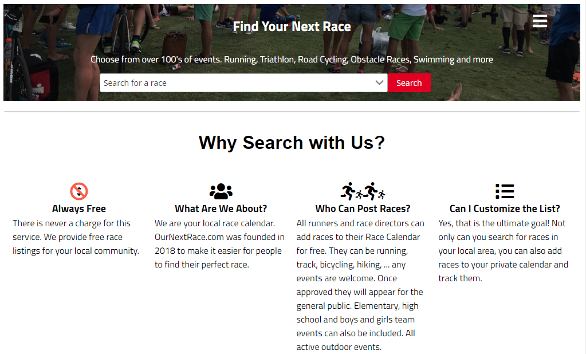
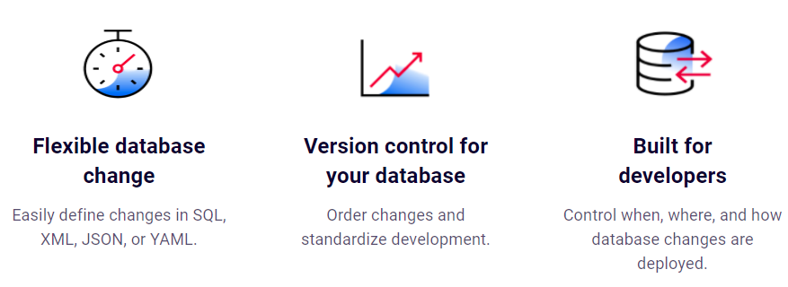
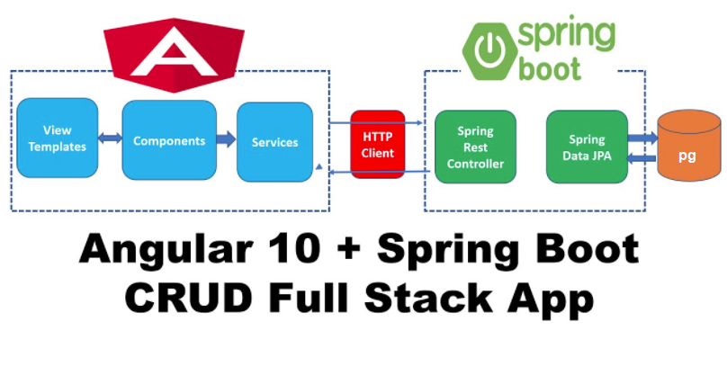

# www.ournextrace.com
### Find races by date, location, or distance: 5K, 10K, half marathon, marathon, ultra, trail, triathlon or duathlon
    
    Note:: the code has references to ijudy.com this is the parent domain I own and
    not a real client or entity

    The UI is in its third iteration. I had originally considered having the users crowd-source
    the races. The UX experience became too cumbersome and now I will reduce complexity by just
    curating the races and not having users create their own races.

    I will add back a [save], [heart] or other way to bookmark a race for future reference.

## ournextrace-db
### Liquibase Implementation
#### Liquibase is an open source project that helps millions of developers rapidly manage database schema changes. 

Liquibase project was created to understand how this utility could be used either stand alone or 
with Spring JPA. My employer is using this tool. Had it not been for that I would have just used
data.sql and schema.sql in JPA.

## ournextrace-ng
The Angular project with the UI to connect to the RESTFUL Spring Boot application. This project is not
complete. The UX became too complicated, and I am reevaluating how to make the experience simpler and
just expose a curated list of races where a user can save their "liked" races.

The project contains service, ngrx for state management, custom components, PrimeNg components and an 
over-engineered grid component. Again my employer was using this grid and I wanted some hands on
experience with it.

## ournextrace-sb
Spring Boot REST API to obtain user and race information after being authenticated using OAUTH 2.0 API 
connecting through to FaceBook and Google

There are a suite of tests that test all the layers. 

    All the passwords and credentials have been removed

### db.properties
Update the properties files with the db credentials to connect to and start the db

## Overall Design

OurNextRace is an easy-to-use Angular/Bootstrap UI that can find and save race information
for the race going enthusiast. The Angular front-end communicates over REST to the Spring Boot 
application located in the same JAR on a small EC2 instance. Previously the PostgresSQL database 
was hosted on RDS but after the pandemic it was more cost-effective to mothball the database and host 
PostgreSQL on the same server.

There is no load balancer even though that would be a good place to store the HTTPS certificates.
Instead, there is a cron job that auto updates the 'LetsEncrypt' certificate every few
months.

AWS's API gateway was considered, but it was unlikely to need the services beyond hosting
the REST API.

There is a rather complicated process for sending out emails to user using velocity templates and
SNS/lambdas. This is part of the AWS security mode to help with preventing Spam.

Authentication is performed by some social provider (Goolgle) as there was no desire to host user
information in a pet project. The client initiates the JavaScript calls to authenticate
via FaceBook, Google or any OAUTH 2.0 provider. I removed Facebook as the API became too brittle.